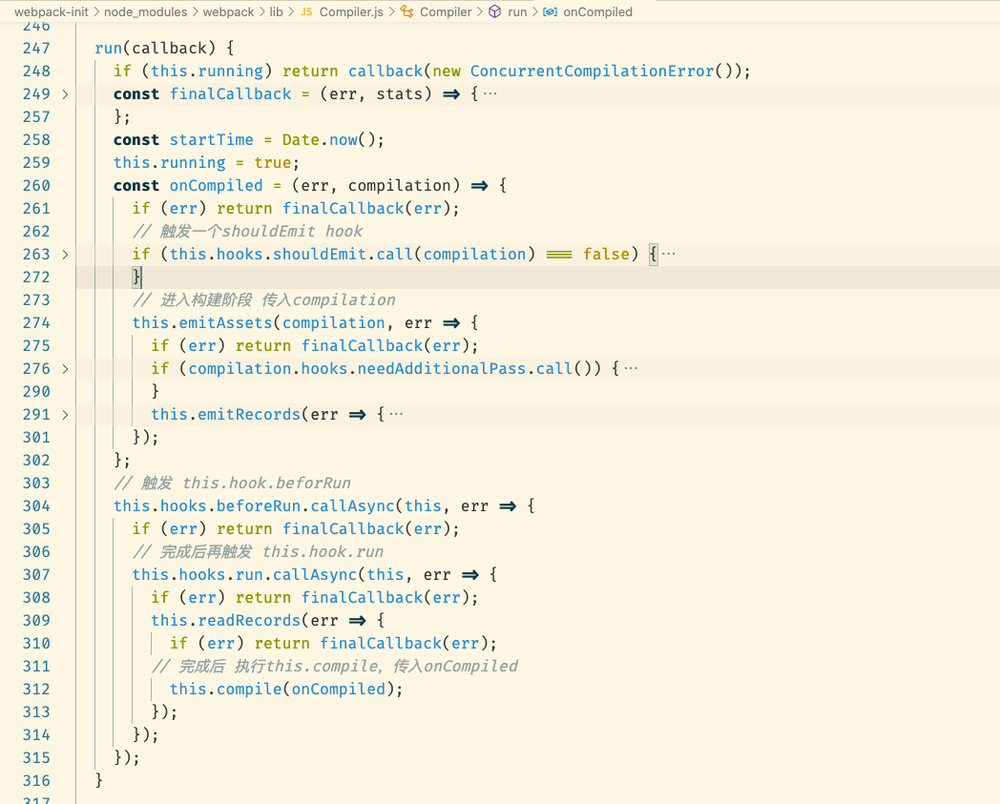

# 三个阶段：

## 一、准备阶段
```js
 if (typeof options === "object") {
    // 初始的一些操作，对一些options的设置
		options = new WebpackOptionsDefaulter().process(options);
		compiler = new Compiler(options.context);
    compiler.options = options;
    // 监听了beforeRun hooks， 然后清理一下构建的缓存
		new NodeEnvironmentPlugin({
			infrastructureLogging: options.infrastructureLogging
		}).apply(compiler);
		if (options.plugins && Array.isArray(options.plugins)) {
			for (const plugin of options.plugins) {
				if (typeof plugin === "function") {
					plugin.call(compiler, compiler);
				} else {
					plugin.apply(compiler);
				}
			}
		}
		compiler.hooks.environment.call();
    compiler.hooks.afterEnvironment.call();
    // entryOption钩子，
		compiler.options = new WebpackOptionsApply().process(options, compiler);
	}
```
  1. **WebpackOptionsDefaulter**，初始化option，设置默认参数。
  2. **NodeEnvironmentPlugin** 监听beforRun hook，然后清理一下构建的缓存。
  3. **WebpackOptionsApply**主要将配置的options参数转换成webpack内部插件，同时监听了entryOption的钩子。
      > **demo：**
        target:'node' ==>  NodeTargetPlugin  
        externals ==>  ExternalsPlugin  
  4. 调用**entryOption**钩子，设置我们项目的**entry**。
  5. 进入**compiler.run**，准备开始构建。
  
**compiler** 的作用：
    先创造compilation对象，然后实例化NormoalModuleFactory和ContextModuleFactory工厂方法；
    走到compiler.run方法，触发this.hook.beforRun，完成之后触发this.hook.run，执行this.compile方法，然后进入执行阶段
    

**compilation**：主要负责模块编译、模块打包的优化，seal完成模块


## 二、构建阶段 （make）  


  1. 最后处理完成的代码放到compilation.modules 组数里面，然后触发succeedModule钩子，最后进入seal阶段，进行优化工作。


## 二、文件生成阶段 （emit） 
  